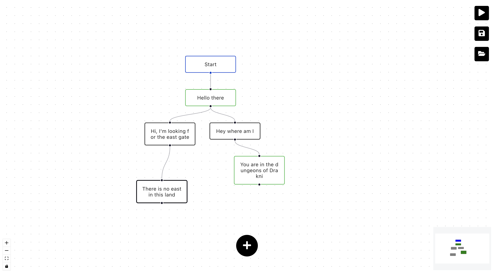

# 🌳 StoryTree

Build branching dialogue trees by dragging boxes around instead of wrestling nested JSON.



## Features

- 🖱️ **Visual editor** — an infinite drag-and-drop canvas, powered by [React Flow](https://github.com/wbkd/react-flow)
- 💬 **Response & choice nodes** — dialogue lines and player branches, color-coded so the tree stays readable
- ▶️ **Play mode** — walk the graph from `Start` and pick your way through it, right in the browser
- 💾 **Save / load** — stash a graph under a name and pull it back up later

## Installation

```bash
git clone <this repo>
cd StoryTree
npm install
```

## Usage

```bash
npm start
```

Then open [http://localhost:3000](http://localhost:3000). You'll land on a single `Start` node — select it, use the `+` menu to add a response or choice node, and keep going from there. Drag to rearrange, drag between handles to connect, ▶ to play, 💾 to save, 📂 to load.

### Example

The tree in the screenshot above:

```
Start
  └─ "Hello there"
       ├─ "Hi, I'm looking for the east gate" → "There is no east in this land"
       └─ "Hey where am I"                    → "You are in the dungeons of Drakni"
```

Press play and it becomes a little choose-your-own-adventure prompt.

Under the hood, each node is just a React Flow element:

```js
{ id: '2', type: 'default', className: 'respons',
  data: { label: 'Hello there' }, position: { x: 0, y: 100 } }
```

with edges connecting `source` and `target` ids — the graph you drag out on screen *is* the data.

## Built with

- [React](https://reactjs.org/) 17
- [react-flow-renderer](https://github.com/wbkd/react-flow)
- [react-icons](https://react-icons.github.io/react-icons/)

## Status

✅ Runs cleanly — `npm install && npm run build` verified working as of 2026-09-03 (build completes with only lint warnings, no errors; `npm start` also compiles the same code, but a live dev-server smoke test on this machine hit an unrelated host-disk-space limit, not a code issue). Still an early prototype: saved graphs live in memory only (gone on refresh), play mode uses browser `prompt()`/`alert()` dialogs, and Firebase is a dependency waiting to be wired up for real persistence.
